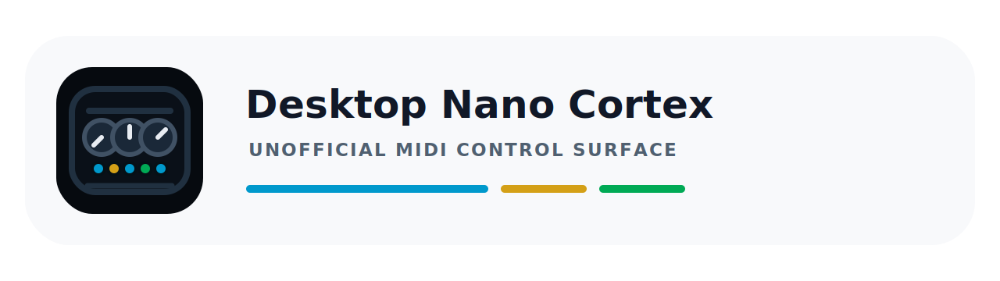
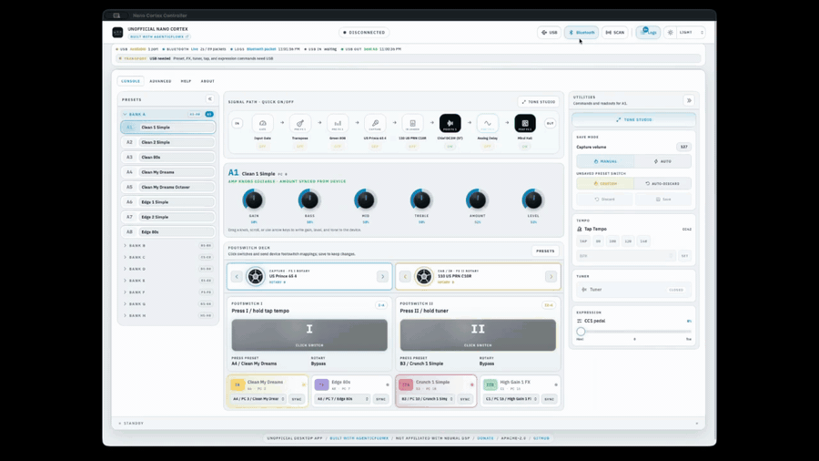
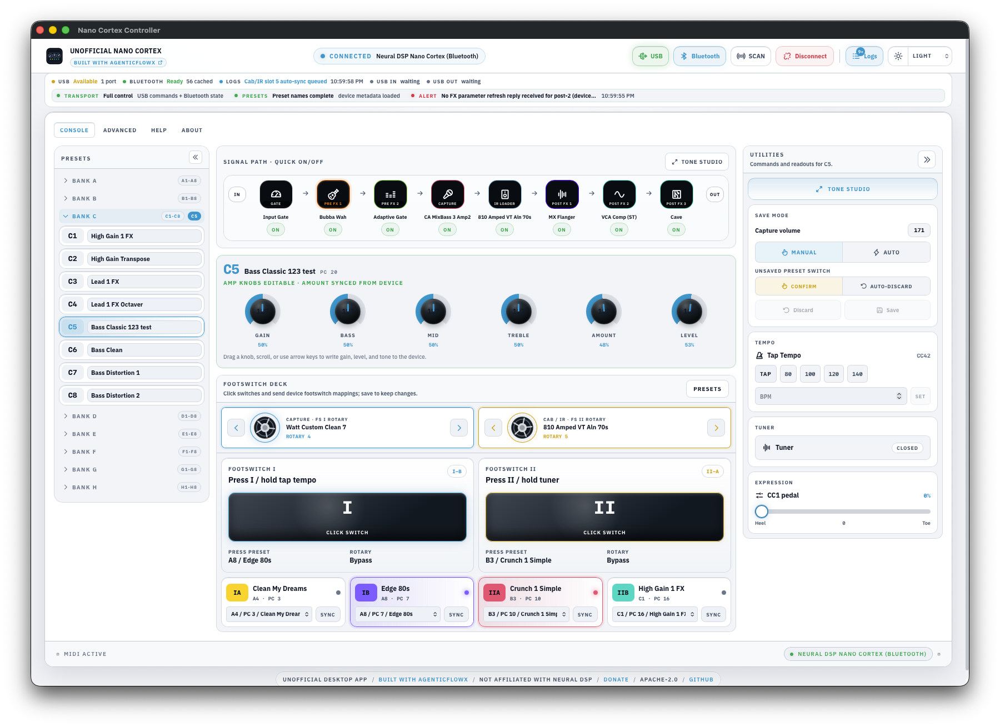
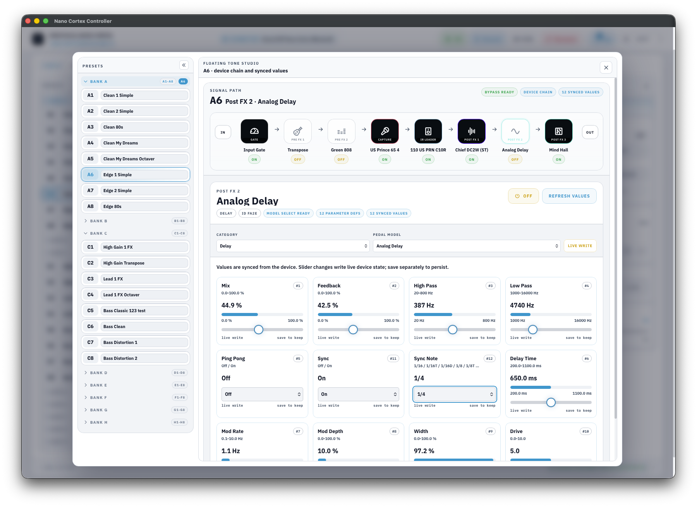
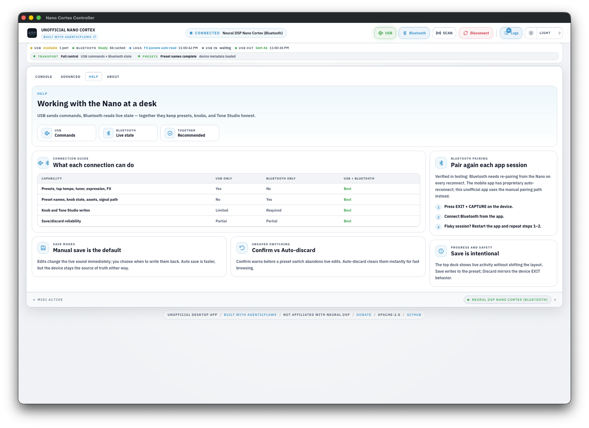
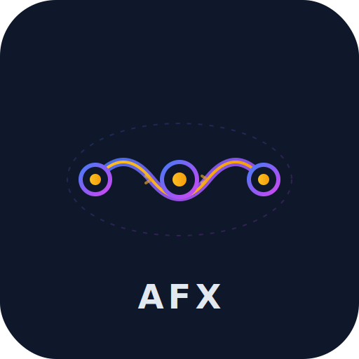

# Desktop Nano Cortex

<p align="center">
  
</p>

[](LICENSE)
[](https://github.com/rixrix/deskop-nano-cortex/releases)
[](https://agenticflowx.github.io/)

> Not affiliated with or endorsed by Neural DSP. v1.0.1 ships unsigned; see
> [Installation](#installation) before sharing a build.

**Desktop Nano Cortex** is an unofficial, cross-platform desktop companion for the
[Neural DSP Nano Cortex](https://neuraldsp.com/nano-cortex). It exists because the pedal has no
public preset/parameter API, and browser tools need WebMIDI/Web Bluetooth (no Firefox, no
Linux). It moves all device I/O into Rust behind a native Tauri shell, and stays honest about
what is documented MIDI versus hardware-observed, provisional Bluetooth state.

## Screenshots

### Demo



### Console

Connected via USB and Bluetooth: live signal path, amp controls, utilities, and footswitch deck.



### Floating Tone Studio

Focused tone editing with the active signal path and synced parameter values.



### Help

Clear guidance for USB/Bluetooth roles, save behavior, pairing, and safe workflow.



## Features

- **Documented MIDI control.** Preset recall, FX on/off, tap tempo, tuner, and expression, sent
  as explicit Program Change / Control Change messages.
- **Live device state over Bluetooth** (experimental). Knob positions, preset names, and
  signal-path state observed from hardware and clearly labelled as provisional.
- **Floating Tone Studio.** A focused view of the active preset's FX chain with synced
  parameter values and manual writes.
- **Footswitch deck.** See and reassign what each onboard footswitch does, mirrored from the
  device.
- **Full preset browser.** All 64 presets across 8 banks, with manual or auto-save workflows.
- **One-click diagnostics.** Export logs and device/connection state for bug reports.
- **Cross-platform build targets.** macOS and Windows 11 are confirmed runtime targets for
  v1.0.1. Linux packages are wired, but remain preview artifacts until platform smoke evidence is
  recorded.
- **Free, open source, and honest.** Apache-2.0 licensed; the UI never claims more device
  capability than has been hardware-verified.

## Built with AgenticFlowX

<table>
<tr>
<td width="96"><a href="https://agenticflowx.github.io/"></a></td>
<td>

This project is built with [AgenticFlowX](https://agenticflowx.github.io/), a spec-driven
development workflow, and it is heavily specced: 10 written spec zones and 289 documented
requirements cover the backend, frontend, IPC contracts, tooling, CI, and governance. Every
owned source file carries a top-level `@see docs/specs/<zone>/{spec,design}.md [ID]` link back
to its governing spec and design note, validated in CI by `npm run lint:trace`. See
[Layout & traceability](#layout--traceability) for the directory map this traces through.

</td>
</tr>
</table>

## Quick start

**Prerequisites:** Node 20+, Rust 1.90+, and the Tauri platform deps for your OS
([macOS: Xcode CLT](https://tauri.app/start/prerequisites/) · Windows: WebView2 + MSVC · Linux: `webkit2gtk-4.1`, `libayatana-appindicator3`, `librsvg2`, `libasound2-dev`).

```bash
npm install                       # root tooling (hooks, lint/format/knip, version sync)
npm ci --prefix frontend          # frontend deps
npm run dev                       # Vite dev server (browser, mocked backend)
npm run dev:tauri                 # full desktop app (Rust backend + webview)
npm run build:mac                 # local dmg/app bundle (see docs/runbooks for Windows)
```

Contributing? See [CONTRIBUTING.md](CONTRIBUTING.md) (hooks, commit scopes, the
`verify → fix → verify` loop) and [AGENTS.md](AGENTS.md) for the product-truth rules.
Privacy posture: [PRIVACY.md](PRIVACY.md). Microsoft Clarity telemetry is on by default
(off toggle in About); device MIDI/BLE data always stays local regardless.

## Installation

Download release artifacts from
[GitHub Releases](https://github.com/rixrix/deskop-nano-cortex/releases). v1.0.1 artifacts are
unsigned, so operating-system trust prompts are expected. macOS and Windows 11 are confirmed
runtime targets; Linux is packaged for review but remains pending until real platform smoke tests
pass.
Each release also includes `SHA256SUMS-v<version>.txt` so downloads can be checked against the
exact build attached to the release page.

### macOS

1. Download the macOS `.dmg`.
2. Open the DMG and drag **Unofficial Nano Cortex.app** into **Applications**.
3. On first launch, right-click the app and choose **Open**, then confirm the Gatekeeper dialog.
4. When macOS asks for Bluetooth access, choose **Allow**. Bluetooth is needed for live device
   state, preset names, and Tone Studio values.

If macOS blocks the app without showing the right-click option, open **System Settings → Privacy
& Security**, scroll to the security notice, and choose **Open Anyway**.

If macOS says the app is damaged, remove the copied app and DMG, download the latest release
artifact again, and check it against the release `SHA256SUMS` file.

### Windows

Windows 11 runtime behavior is confirmed for v1.0.1. Windows artifacts are still unsigned, so
SmartScreen prompts are expected.

1. Download the `.msi` or `-setup.exe` from the release.
2. SmartScreen will warn because the installer is unsigned. Choose **More info → Run anyway** only
   if you trust the release source.
3. WebView2 is normally included on Windows 11. On Windows 10, install WebView2 if the app does
   not launch.

### Linux

Linux packages are pending runtime validation for v1.0.1. Bluetooth support is not currently a
release claim on Linux.

- `.deb`: install with your package manager, for example `sudo dpkg -i <file>.deb`.
- `.AppImage`: mark executable with `chmod +x <file>.AppImage`, then run it.

Use Linux builds as preview artifacts until USB MIDI launch and device-control smoke tests are
recorded.

## Documented MIDI control

Everything the UI sends maps to the official Nano Cortex MIDI list. Helpers clamp to valid ranges.

| Control       | Message               | Range              |
| ------------- | --------------------- | ------------------ |
| Preset recall | Program Change `0-63` | preset 1-64        |
| FX slots 1-5  | CC `37-41`            | `0` off / `127` on |
| Tap tempo     | CC `42`               | momentary `127`    |
| Tuner         | CC `43`               | `0` off / `127` on |
| Expression    | CC `1`                | `0-127`            |
| MIDI channel  | -                     | `1-16`             |

Anything beyond this is **experimental** and gated behind `EXPERIMENTAL_FEATURES` (on in `vite dev`, off in production unless `VITE_EXPERIMENTAL=true`): the `DesktopEditor` slot editor, the `PedalWorkbench` pedal sketch, and the `ProtocolLab` "Capture Lab" BLE trace surface. These render BLE-decoded/observed values and a local model; they do **not** yet write confirmed parameters to the device. BLE-decode honesty notes (device→host state, the expression pedal) are in [Caveats](#caveats).

## Architecture

React + TypeScript frontend, Rust + Tauri 2 backend. All device I/O (USB MIDI, BLE) lives in
Rust; the webview only sends documented commands and renders observed or provisional state.
Full architecture map: [`docs/specs/001-overview`](docs/specs/001-overview/spec.md).

## Diagnostics

When something misbehaves, grab a shareable report: **Copy diagnostics** (Event Log footer, or Advanced → Settings → Diagnostics) copies the recent in-memory log buffer plus app/device/connection metadata to the clipboard; **Save diagnostics…** writes the same bundle to a file. For deeper BLE captures, the experimental **Capture Lab** brackets trace sessions, and `NANO_BLE_DEBUG=1` enables raw packet capture; every `midi://log` line is also appended to `logs/protocol-lab.log` during development.

## Testing

```bash
npm test            # Rust unit tests (cargo) + frontend unit tests (Vitest)
npm run e2e         # Playwright E2E (Chromium vs. dev server, mocked Tauri IPC)
npm run lint        # ESLint + clippy(-D warnings) + traceability gate
npm run format:check
```

- **Rust** (`backend/`): `#[cfg(test)]` units for port matching, MIDI parsing, the provisional BLE decoder, and the footswitch/state serde contracts.
- **Vitest** (`frontend/`): the documented-MIDI byte encoder, constants, decoders, hooks, and a component smoke test.
- **Playwright** (`frontend/e2e/`): the real React app in Chromium with `window.__TAURI_INTERNALS__` stubbed ([fixtures/tauri-mock.ts](frontend/e2e/fixtures/tauri-mock.ts)): boot, navigation, connect IPC, UI-triggered `send_midi` byte correctness, inbound events. The screenshots above were captured from this suite.

## Layout & traceability

```
backend/    Rust + Tauri crate (app, domain, infrastructure/midi, ipc, platform, bin/ probes)
frontend/   React + Vite + Tailwind (app, features/midi, shared, e2e)
docs/specs/ numbered zone specs (001-overview + 100-500), the living source of truth
tools/      BLE analysis (python/swift)
scripts/    check-traceability.mjs (the @see gate)
```

See [Built with AgenticFlowX](#built-with-agenticflowx) for the spec-driven convention this layout follows.

## Caveats

| Area              | Detail                                                                                                                                                                                                                                                                                                                                                                                                                                                                                               |
| ----------------- | ---------------------------------------------------------------------------------------------------------------------------------------------------------------------------------------------------------------------------------------------------------------------------------------------------------------------------------------------------------------------------------------------------------------------------------------------------------------------------------------------------- |
| Unsigned build    | v1.0.1 is unsigned. macOS and Windows will show trust prompts; see [Installation](#installation). Signing secrets and release notes are documented for a later signed release.                                                                                                                                                                                                                                                                                                                       |
| Platform testing  | macOS and Windows 11 have current runtime coverage. Linux artifacts are release-wired but untested for v1.0.1; publish or share Linux packages as untested previews until their platform smoke checks pass.                                                                                                                                                                                                                                                                                          |
| BLE support       | Experimental, macOS/Windows only (feature-gated; off on Linux). Bluetooth-decoded values are provisional until verified against hardware.                                                                                                                                                                                                                                                                                                                                                            |
| USB feedback      | No two-way USB feedback: on the tested hardware the Nano Cortex sends **zero** device→host USB MIDI (see Device→host state below); the USB input listener works but has no data to receive. Onboard control changes are observed over BLE instead.                                                                                                                                                                                                                                                   |
| Device→host state | BLE-only. This is hardware sensor data (knob, footswitch, and pedal readings sent from the device), not app telemetry; see [PRIVACY.md](PRIVACY.md) for the app's privacy posture. USB MIDI carries **nothing** device-to-host (verified: zero bytes across all captures). The observed Bluetooth state map is catalogued in [`docs/specs/110-backend-midi-ble`](docs/specs/110-backend-midi-ble/spec.md) as an **unverified** reference; no capability is claimed until confirmed against hardware. |
| Expression pedal  | Reported only over BLE and **quantized to 3 zones**: heel, center, and toe (`0`/`128`/`255`), never continuous, even on slow sweeps. Two different pedals (Line 6, Boss) produced signature-identical packets, so the quantization is the device's. The value stays provisional (backend `expression_values` capability remains `Unverified`).                                                                                                                                                       |
| Telemetry         | Microsoft Clarity is on by default, with an off toggle in About → Telemetry posture. See [PRIVACY.md](PRIVACY.md) for exactly what's collected.                                                                                                                                                                                                                                                                                                                                                      |

## License

Apache-2.0. See [LICENSE](LICENSE).
